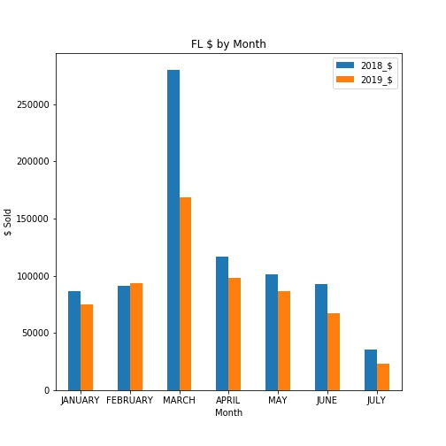

# House of Wu Data Visualization 

### Problem
House of Wu is a formal wear wholesale business that has sales representatives all over the United States. To tack their sales for every month, the company disributes a convoluted excel spreadsheet that tracks the amount of product that each representative sells. This is broken down into states and total amount of product that is sold for each individual line. In an effort to better convey progress per month, I created python scripts that automates the process of generating graphics like the following: 

